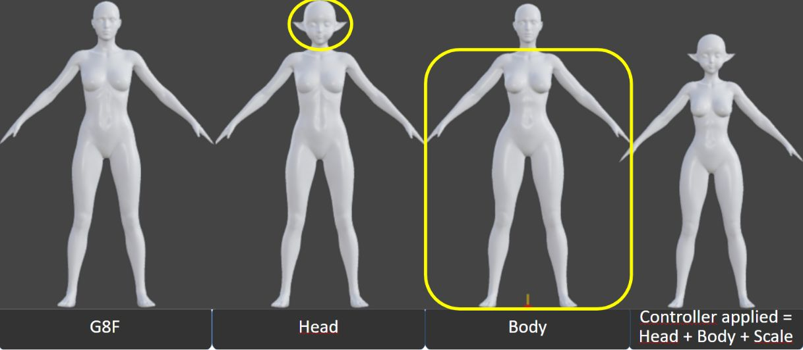
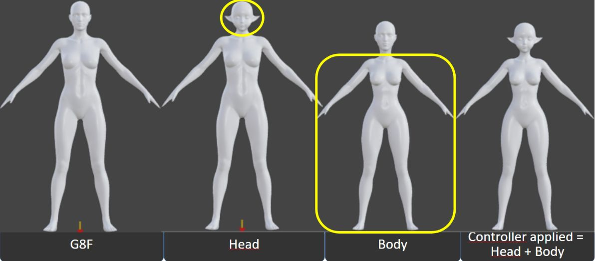
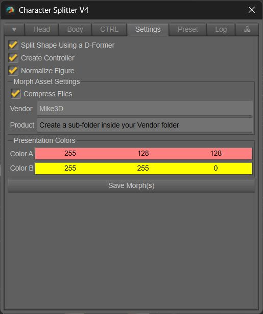
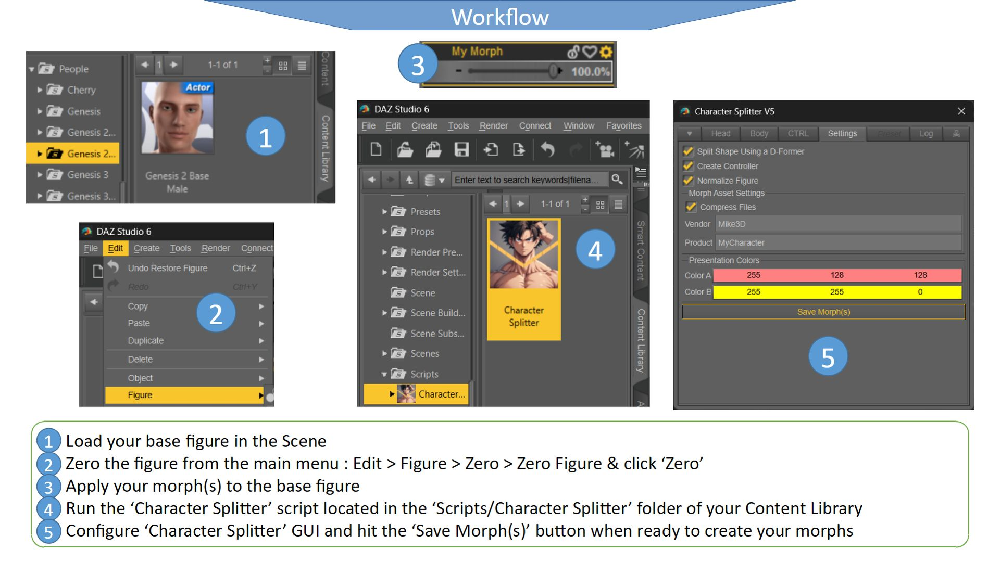

# Character Splitter for DAZ Studio

### Tool for splitting a character shape between head & body

* Create separate head & body morphs from a full character
* 2 methods available : 'normalized' & 'WYSIWYG'
* Optionally create a controller morph to apply the full character, including scaling factor
* Also create morphs for eyelashes (G8, G8.1 & G9), tear (G8.1 & G9), mouth, eyes & eyebrows (G9)
* Head split DFormer presets included for all the Genesis figures
* Ability to setup morphs 'presentation' (images & colors)
* Ability to create a character preset or some shaping presets
* Ability to create a morph from any shape
* Ability to delete any unwanted morphs
* Accuracy : the body morph doesn't include deltas pertaining to the head (only body & neck)
* Full control over the final result
* Fully automated

The tool works with Daz Studio 6, but should also work with previous versions (no warranty). If you're using Daz Studio 4 and the tool doesn't work, you can try [this version](https://github.com/Mike3D/Character-Splitter-for-DAZ-Studio/releases/tag/v3) instead.

## 'Normalized' head & body parts split
The focus of this method, documented [here](<User_Manual/Under the hood Normalized.pdf>), is to rescale your character to standard proportions (ie. the base figure), creating head & body morphs that will smoothly blend realistically with almost all the morphs that you own : you won't get a disproportionate head morph for your body morphs or a disproportionate body morph for your head morphs. The scaling needs, especially for non-adult characters or anime & fantasy creatures, are satisfied with the controller morph. This is how it looks when applied to a fantasy character :

## 'WYSIWYG' head & body parts split
The focus of this method, documented [here](<User_Manual/Under the hood WYSIWYG.pdf>), is to faithfully preserve the proportions of your character : head & body parts are split as-is. It is especially suited if your character head & body don't dramatically differ from the base figure. This is how it looks when applied to the same fantasy character (which is not the ideal candidate for this method) :

Note that you can freely rescale your figure before executing the script. This is useful if you want your character to be a few inches taller or shorter than the base figure.

## Create morphs from any shape
As a bonus, you can use this script to create morphs from any shape (figure or prop). To do so, just uncheck the 'Split Shape Using a DFormer' option, found in the 'Settings' Tab. This disables the 'Body' & 'CTRL' Tabs, which are no longer relevant.

## Create morphs for head attachments (G8/G9) : eyelashes, tear, mouth, eyes & eyebrows
A morphs can be created for each head component. However, if you didn't modify the geometry for some components, you don't want to create morphs for them. From 'Head' tab you will find the list of attachments. Those that are not morphed will be excluded by default, but you can freely include them if you want.

## Delete any unwanted morphs
Last Tab of the GUI allows to delete any unwanted morphs. This is especially useful :
* in case something went wrong at any step of the process
* if you want to 'overwrite' an existing morph
* if you just want to definitively suppress any morph from your figure

## Create a character preset or some shaping presets
Once you've saved yours morph(s), the 'Preset' tab becomes visible and available. It allows to create a character preset when a controller has been created, or some shaping presets otherwise.

## Customize everything from the GUI
The first 5 tabs of the GUI allow to tailor everything to suit your needs, allowing you to create a production-ready split character.

## A simple workflow

## Installation

* Remove any preexisting version
* Download this repository by hitting the 'Code' button at the top of this page, then select 'Download ZIP'
* Extract the 'Scripts' folder to one of your Daz Studio content libraries ('My DAZ 3D Library' is the default, the list is available in Daz Studio menu Edit > Content > Content Directory Manager, and they are visible in the 'Content Library' pane, from which you can open the folders with a right-click > Browse to Folder Location). If you choose 'My DAZ 3D Library' as destination, this will merge into existing 'Scripts' folder
* You can extract the 'User_Manual' folder anywhere

Your Content Library pane should look like this :

Note that G8F, G8M & G9 will only appear after running the script for the first time, which will create symbolic links (symlinks) pointing to the DFormer presets found in the 'Developer Kit' folder of each figure, starting from G8.
Also note that they will appear only if these figures are already installed.

For Windows users, you will have the choice between creating symlinks or duplicating the files, depending on your privileges (administrator required) or your preferences. You can also create the symlinks yourself at any time.

If everything went fine you should see all DFormer presets in the Content Library pane, as pictured above.

## Usage

Please refer to the [User Manual](<User_Manual/User Manual.pdf>).

## Getting in touch

If you want to get in touch, you can find us on the Daz 3D Forums :

https://www.daz3d.com/forums/discussion/617476/character-splitter

## Miscellaneous

* You can use any DFormer preset of your choice as long as you apply it before running the script. Automatic selection only kicks in when no DFormer is applied
* You can create & use your own DFormer presets, for example when using Character Splitter on your own custom figures. An indicative tutorial is given [here](User_Manual/D-Former%20Preset%20Creation.pdf) for the creation process. If you want your custom DFormer to be automatically detected & applied, you will have to put it with the other DFormers (in the 'Scripts/Character Splitter' folder) and use your figure name (not label) as name. Taking G8M as example, expected DFormer preset file should be 'Genesis8Male.duf' (not 'Genesis 8 Male.duf', which is G8M label)