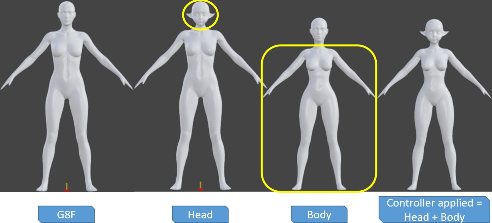
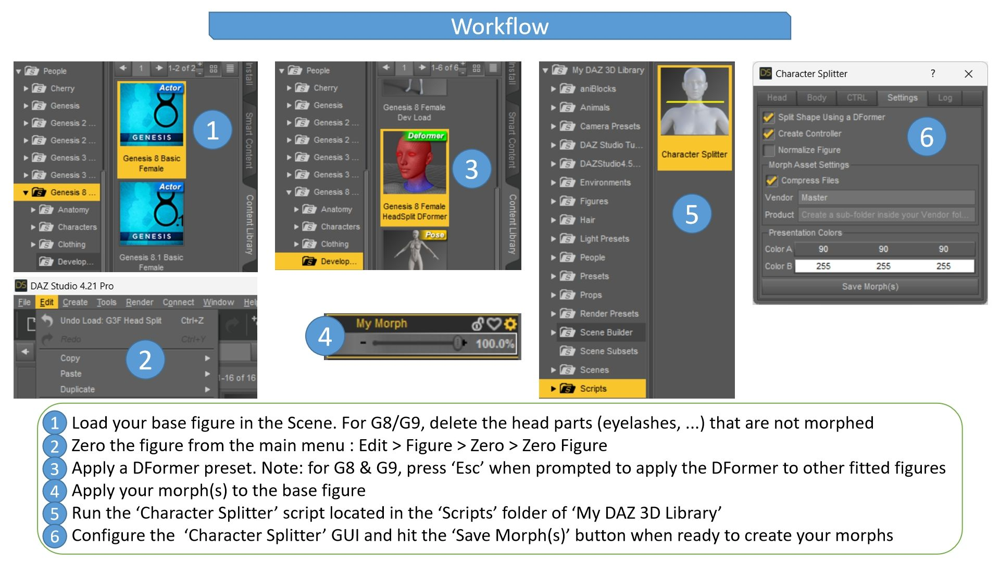

# Character Splitter for DAZ Studio

### Tool for splitting a character shape between head & body

* Create separate head & body morphs from a full character
* 2 methods available : 'normalized' & 'WYSIWYG'
* Optionally create a controller morph to apply the full character, including scaling factor
* Also create morphs for eyelashes (G8 & G9), tear (G8.1 & G9), mouth, eyes & eyebrows (G9)
* Head split DFormer presets included for all the Genesis figures
* Ability to setup morphs 'presentation' (images & colors)
* Ability to create a morph from any shape
* Ability to delete any unwanted morphs
* Accuracy : the body morph doesn't include deltas pertaining to the head (only body & neck)
* Full control over the final result
* Fully automated

## 'Normalized' head & body parts split
The focus of this method is to rescale your character to standard proportions (ie. the base figure), creating head & body morphs that will smoothly blend realistically with almost all the morphs that you own : you won't get a disproportionate head morph for your body morphs or a disproportionate body morph for your head morphs. The scaling needs, especially for non-adult characters or anime & fantasy creatures, are satisfied with the controller morph. This is how it looks when applied to a fantasy character :

## 'WYSIWYG' head & body parts split
The focus of this method is to faithfully preserve the proportions of your character : head & body parts are split as-is. It is especially suited if your character head & body don't dramatically differ from the base figure. This is how it looks when applied to the same fantasy character (which is not the ideal candidate for this method) :

Note that you can freely rescale your figure before executing the script. This is useful if you want your character to be a few inches taller or shorter than the base figure.

## Create morphs from any shape
As a bonus, you can use this script to create morphs from any shape (figure or prop). To do so, just uncheck the 'Split Shape Using a DFormer' option, found in the 'Settings' Tab. This disables the 'Body' & 'CTRL' Tabs, which are no longer relevant.

## Create morphs for head components (G8/G9) : eyelashes, tear, mouth, eyes & eyebrows
A morphs is created for each head component. However, if you didn't modify the geometry for some components, you don't want to create morphs for them. In this case, simply delete these parts after loading the base figure into the Scene.

## Delete any unwanted morphs
Last Tab of the GUI allows to delete any unwanted morphs. This is especially useful :
* in case something went wrong at any step of the process
* if you want to 'overwrite' an existing morph
* if you just want to definitively suppress any morph from your figure

## Customize everything from the GUI
The first 4 tabs of the GUI allow to tailor everything to suit your needs, allowing you to create a production-ready split character.

## A simple workflow

## Installation

* Download this repository by hitting the 'Code' button at the top of this page, then select 'Download ZIP'
* Extract the 'Scripts' folder to your Daz Studio content library ('My DAZ 3D Library')
* Extract the 'DFormers' folder content at a convenient place, for example globally inside 'My DAZ 3D Library/Presets', or create a 'Developper Kit' for each figure, to mimic G8 & G9 logic, ...
* You can extract the 'User_Manual' folder anywhere

## Usage

Please refer to the User Manual in the eponymous folder.

## Miscellaneous

You can find head split DFormer presets for :
* G9 and G8 : in the 'Developper Kit' of these figures (they are included with the base figures)
* Genesis, G2 and G3 : in the 'DFormers' folder of this repository (see Installation above)

You can also create your own DFormers. In this case, you may have to adjust the 'Reference Vertex' accordingly.